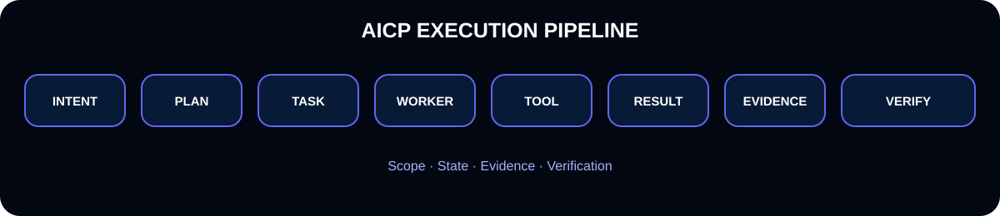
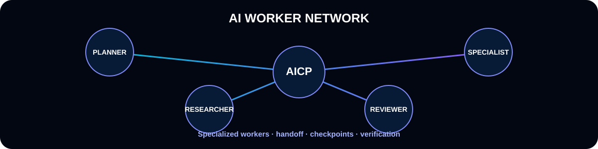

<div align="center">


# AICP — AI Collaboration & Intelligence Platform

### Building the control plane for AI workers.

**Plan · Execute · Verify · Recover**

[](https://github.com/faridbarahimi)
[](https://github.com/faridbarahimi)
[](https://github.com/faridbarahimi/faridbarahimi)
[](https://faridbarahimi.github.io/faridbarahimi/)

</div>

---

## 🧠 The Idea

> **AI should not only answer. AI should work.**

AICP is being built as a governed work-orchestration and execution control plane for AI workers: systems that can understand a goal, plan bounded work, use tools, produce evidence, verify outcomes, recover from interruption, and continue.

<div align="center">

</div>

---

## ⚡ What AICP Connects

| Layer | Purpose |
|---|---|
| 👤 **Human** | Goals, decisions and authorization |
| 🧠 **AICP Core** | Governance, orchestration, state, evidence and policy |
| 🤖 **AI Workers** | Specialized planning, execution, research and review |
| 🧩 **Models** | Capability-aware model/provider routing |
| 🔧 **Tools** | GitHub, web, desktop, VPS, APIs and files |
| 🧾 **Evidence** | Traceable results and independent verification |

---

## 🔄 The Execution Model

<div align="center">

</div>

```text
INTENT → PLAN → TASK → WORKER → TOOL → RESULT → EVIDENCE → VERIFY
```

> **Worker STOPPED ≠ Task STOPPED**

A task should retain state and checkpoints so another worker can continue it without starting from zero.

---

## 💰 Cost-Aware AI Routing

AICP is designed around capability **and** economics, not model prestige.

<div align="center">

</div>

```text
Task → Capability Analysis → Complexity → Cost Constraint
                                      │
                         ┌────────────┼────────────┐
                         ↓            ↓            ↓
                      Free/Cheap   Specialist   Escalation
                         │            │            │
                         └────────────┴────────────┘
                                      ↓
                                 Verification
```

---

## 🛡️ Governance & Evidence

AICP treats important execution claims as something that should be provable.

```text
PROPOSED → REVIEW → ACCEPTED → AUTHORIZED → IMPLEMENTED → VERIFIED

CLAIM → EVIDENCE → COMMAND → RESULT → VERIFICATION
```

This creates a boundary between **what was suggested, what was authorized, what was executed, and what was actually verified**.

---

## 🤖 AI Worker Ecosystem

<div align="center">

</div>

AICP's worker model supports specialized roles, bounded tasks, handoff, checkpoints, independent verification and recovery.

| Role | Responsibility |
|------|----------------|
| **Planner** | Plans & breaks down complex tasks |
| **Worker** | Executes tasks and uses tools |
| **Reviewer** | Validates results & ensures quality |
| **Researcher** | Finds information & insights |
| **Specialist** | Domain experts & deep analysis |

---

## 🔄 Worker Continuity

<div align="center">

</div>

```text
Worker A (Checkpoint) → STOPPED → Worker B (Continue) → Result
```

A failed or stopped worker does not mean the task is lost. State and evidence travel with the work.

---

## 🚀 Projects

### 🧠 AICP
**AI Collaboration & Intelligence Platform** — the work orchestration and AI worker control-plane foundation.

[View the AICP Core Platform repository →](https://github.com/faridbarahimi/AICP-Core-Platform)

### 🤖 Karen
A broader human-like AI worker vision built around persistent capabilities, tools, continuity and real-world task execution.

### ⚙️ AI Worker Infrastructure
Reusable primitives for routing, execution, evidence, verification, recovery and controlled machine access.

---

## 🧰 Engineering Focus

AI Agents · Multi-Agent Systems · Work Orchestration · Model Routing · Automation · Governance · Evidence · Verification · Recovery · GitHub · Linux · VPS · Python · TypeScript

---

## 📊 GitHub Activity

<div align="center">


<br/>


</div>

---

## 🧭 Architecture Principles

- **Evidence over assumptions**
- **Small changes over risky rewrites**
- **Human authorization at governance boundaries**
- **Worker failure must not imply task failure**
- **Capability reuse over unnecessary rebuilding**
- **Route work according to capability and cost**
- **Important operations should be independently verifiable**
- **Automation should be resumable**

---

## 🗺️ Roadmap

| Version | Focus | Status |
|---------|-------|--------|
| **v0.1** | Core Platform | ✅ Done |
| **v0.2** | Multi-Model | 🔄 In Progress |
| **v0.3** | Multi-Agent | 📋 Planned |
| **v0.4** | Full Ecosystem | 📋 Planned |

---

## 🔭 Direction

```text
                         HUMAN
                           │
                           ▼
                     ┌───────────┐
                     │   AICP    │
                     │  CONTROL  │
                     │   PLANE   │
                     └─────┬─────┘
                           │
             ┌─────────────┼─────────────┐
             ▼             ▼             ▼
          Workers        Models         Tools
             │             │             │
             └─────────────┼─────────────┘
                           ▼
                    REAL WORLD WORK
                           │
                           ▼
                  EVIDENCE + VERIFY
                           │
                           ▼
                       RECOVER
```

<div align="center">

### Building toward AI that can do useful work — safely, visibly, and continuously.

**AICP · AI Workers · Karen**

<br/>

[🌐 Live Dashboard](https://faridbarahimi.github.io/faridbarahimi/) · [⭐ Star on GitHub](https://github.com/faridbarahimi/faridbarahimi)

</div>
