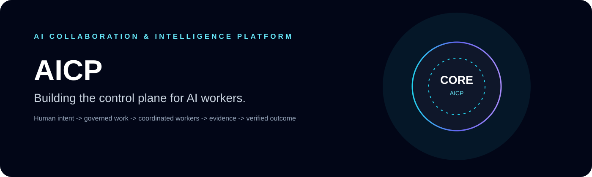
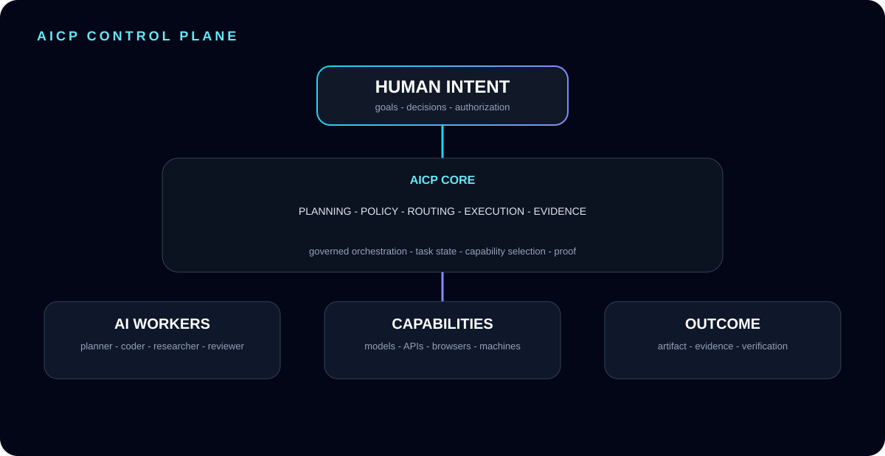
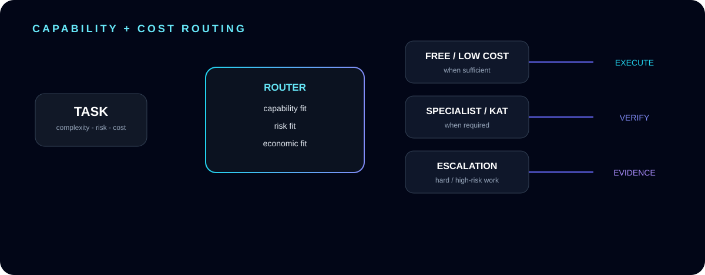
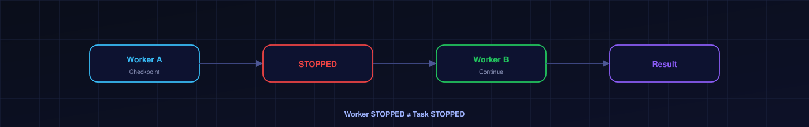
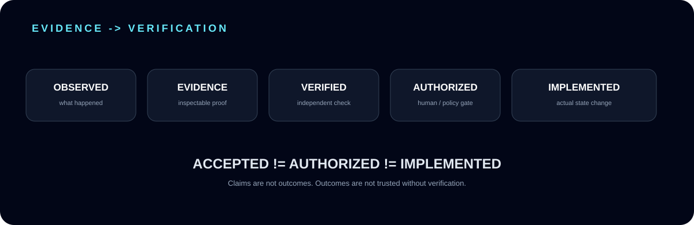

# FARID BARAHIMI

### Building the control plane for AI workers.

**AICP · AI Collaboration & Intelligence Platform**  
*Human intent → governed work → coordinated AI workers → evidence → verified outcome.*

---

## ◈ AICP — THE CONTROL PLANE

AICP is being built as a **work orchestration and control plane for AI workers** — not merely an LLM wrapper or prompt router.

The architecture turns human intent into durable, governed work across heterogeneous workers, models, tools, machines and external services.

> **AICP does not merely answer. It governs work.**

A worker can stop. A provider can fail. A model can disappear. A machine can disconnect.  
**The task must remain a durable object.**

---

## ◈ CAPABILITY + COST ROUTING

AICP uses capability-aware and cost-aware routing:

**FREE / LOW COST → SPECIALIST → ESCALATION**

The principle is simple: use **sufficient capability with controlled risk and cost**, rather than treating the most expensive model as the default.

---

## ◈ WORKER CONTINUITY

### WORKER STOPPED ≠ TASK STOPPED

Tasks are durable. Workers are replaceable execution resources.

This enables:

- resumable checkpoints
- worker/provider replacement
- isolated task transactions
- recovery after interruption
- independent verification
- controlled publication

---

## ◈ EVIDENCE BEFORE TRUST

**OBSERVED → EVIDENCE → VERIFIED → AUTHORIZED → IMPLEMENTED**

AICP preserves a critical governance distinction:

### ACCEPTED ≠ AUTHORIZED ≠ IMPLEMENTED

A confident worker response is not proof of an actual system outcome.

---

## ◈ ARCHITECTURE PRINCIPLES

| Principle | Meaning |
|---|---|
| **Human Authority** | Consequential decisions and implementation authorization remain explicit. |
| **Durable Tasks** | Work survives worker/provider interruption. |
| **Isolation** | Tasks operate inside explicit execution boundaries. |
| **Evidence** | Important claims and outcomes have inspectable proof. |
| **Verification** | Completion is independently checked rather than assumed. |
| **Cost Control** | Routing considers capability, risk and economic fit. |
| **Provider Agnosticism** | Execution resources can be replaced. |
| **No Partial Publication** | Unverified work is not silently promoted as final. |
| **Controlled Machine Access** | External machines and tools are governed. |
| **Knowledge Continuity** | Architecture knowledge remains durable and auditable. |

---

## ◈ ENGINEERING AREAS

AI WORKER ORCHESTRATION · GOVERNED EXECUTION · TASK TRANSACTIONS  
WORKER CONTINUITY · PROVIDER CAPABILITY DISCOVERY · REAL INFERENCE VERIFICATION  
EVIDENCE & EXECUTION OUTCOMES · CONTEXT BUDGETING · RETRIEVAL  
CONTROLLED MACHINE ACCESS · AI / ECONOMIC FIT · AUTOMATION COMPLIANCE RISK  
KNOWLEDGE CONTINUITY · MULTI-AGENT COST CONTROL

---

## ◈ AICP ECOSYSTEM

### ⚙️ AICP-Core-Platform

The engineering repository for the AICP control-plane implementation, architecture decisions, tests, governance and execution infrastructure.

**→ [Explore AICP-Core-Platform](https://github.com/faridbarahimi/AICP-Core-Platform)**

### 🧠 Karen

The broader human-like AI worker vision operating across web, desktop, ChatGPT, Claude, Gemini, Grok and other capability providers.

**AICP = control plane. Karen = worker-oriented experience.**

---

## ◈ THE ENGINEERING LOOP

**HUMAN INTENT**  
↓  
**TASK DEFINITION**  
↓  
**GOVERNANCE / POLICY**  
↓  
**CAPABILITY ROUTING**  
↓  
**ISOLATED EXECUTION**  
↓  
**CHECKPOINT + EVIDENCE**  
↓  
**INDEPENDENT VERIFICATION**  
↓  
**AUTHORIZATION**  
↓  
**PUBLICATION**

---

## ◈ BUILD PHILOSOPHY

**Small task packets.**  
Large work is decomposed into bounded transactions that can be executed, tested, verified and resumed independently.

**Cheap first.**  
Free or low-cost capability is used when sufficient.

**Specialist escalation.**  
Hard work escalates only when the task genuinely requires stronger capability.

**No silent state changes.**  
Important changes remain explicit, inspectable and attributable.

**Proof over confidence.**  
A successful response is not the same as a verified outcome.

---

## ◈ PUBLIC ENGINEERING PROFILE

This profile is the **visual front door to the AICP architecture**, while the implementation repository remains the engineering source.

**github.com/faridbarahimi**  
→ AICP Visual Control Center  
→ **github.com/faridbarahimi/AICP-Core-Platform**  
→ Architecture · ADRs · Tests · Governance · Implementation

---

### BUILDING INFRASTRUCTURE FOR AI THAT CAN ACTUALLY DO WORK.

**AICP — GOVERNED WORK · COORDINATED WORKERS · VERIFIABLE OUTCOMES**

 

<a href="https://github.com/faridbarahimi/AICP-Core-Platform">EXPLORE THE ENGINEERING REPOSITORY →</a>

